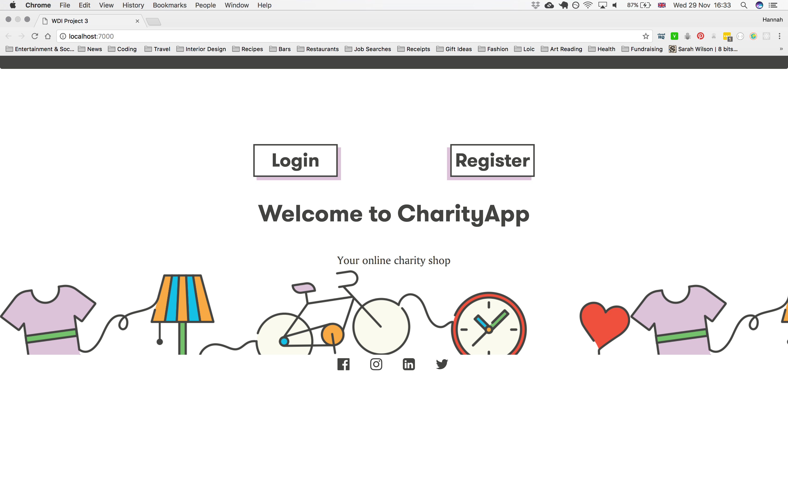
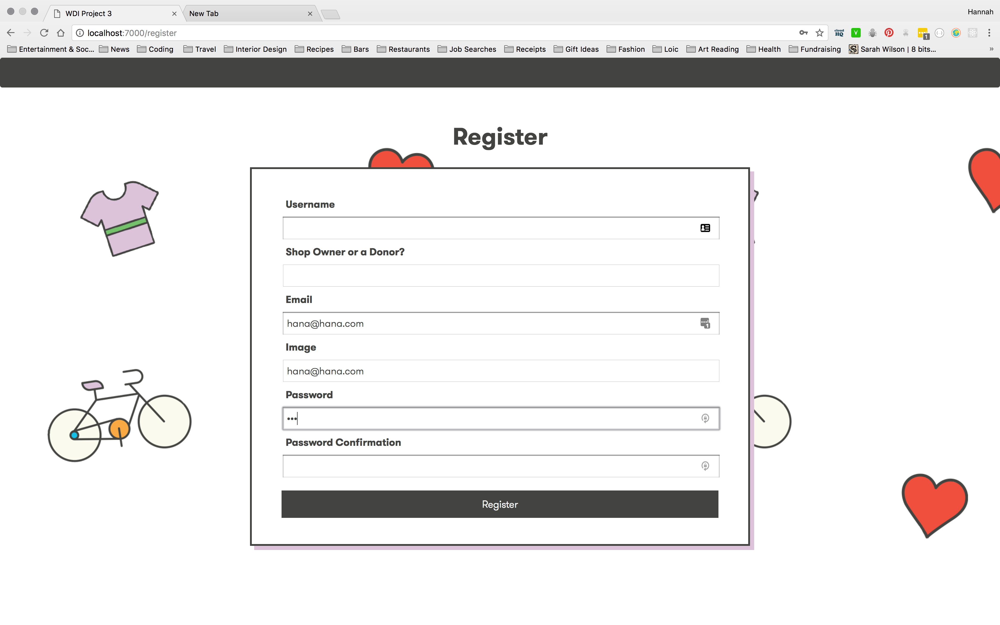

<h1>WDI GROUP PROJECT</h1>

For Module Three of the General Assembly Web Development Immersive we were brought together to develop an idea for a MEAN stack application.

Our brief was to create a fully restful MEAN stack web application with authentication and features such as ratings or comments.

<h2>Concept</h2>

After an afternoon of brainstorming where we came up with a variety of ideas, we all came to agree on a particular idea that engaged with a shared interest.

We all wanted to create an App that had a community or social benefit. This led to us conceiving of 'Charity App' - an app that offers a platform for Charity Shops to communicate with their local community. 

A charity shop would create an account with our app and create a profile page. On this page they could state what items they are in need of and what items they have enough of or can't sell. For example, a shop could say: "We have plenty of books but we really need more children's clothes because we have a lot of young families in our local area. "

<h2>Planning</h2>

Once we had agreed a concept we took our time to draw out our plan for the App. We drew basic layout and designed a user flow through the website. We used a wireframing tool and several pieces of scrap paper to map out our ideas and visualise how our logic would work.

<h2>Task Allocation</h2>

One of the main words of advice our tutors gave us was that each person in a team should tackle a task they are least comfortable with, in order to maximise learning. With this in mind we attempted to break down our project into sections which could then be distributed amongst ourselves. This was more challenging than we first thought!

We divided up tasks into, setting up the Express server; restful routes on the front-end and back-end; testing these routes; completing the wireframe; authentication; logic for comments; making the ajax request to the Google Maps API; autocomplete using Google Places; and styling

<h2>Challenges</h2>

Catriona:
<li>Creating a 'Delete' Modal and getting the user id from the payload. </li>
<li>Also challenging to understand why something wasn't working or a test failing whether you needed to still write some code or if it was someone else's responsibility - how to make it work in a group context</li>

Cameron:
<li>Using angular holistically - until now it has been in pieces and fragments so it has been useful to learn how to combine all these elements.
<li>Working with an API and embedding google places - but then great to find angular scripts which make life a lot easier.</li>

Hannah:
<li>Realising that once a project is broken into segments I was not so confident in my understanding of how the files in a MEAN stack communicate with one another. </li>
<li>The comments feature was much more complicated than anticipated - for example, how to add and delete a comment without refreshing the page</li>

<h2>Successes</h2>

Catriona:
<li>Setting up the server for the app. </li>

Cameron:
<li>Setting up the back-end files. As a tried and tested recipe it was rewarding to sucessfully set up RESTful routes and the Express app. </li>

Hannah:
<li>Testing - I became really appreciative of how this methodology and code can illuminate issues which are hidden or obscured. The green ticks became rather addictive. It also helped with how I approach error-hunting. </li>
<li>Appreciation of the benefits of strategic console logging and grabbing properties from api objects to solve problems.</li>

<h2>Learning</h2>

<strong>Communication is key.</strong>
We agreed that in our previous careers we have worked in teams but the way in which you work as a team when coding is very particular.
The interdependent nature of the features, functions and files in a web devlopment project requires regular and consistent communication between team members.
One of the benefits of a group project was having people on hand who understand your project and to whom you can talk things through with. Having a team allows you to take a step back and support each other and avoid getting lost down  rabbit holes!
We also found that our individual morale was boosted by getting and giving help.
We also learned a great deal about the GIT process and emulated how we might have to use git and github in a project environment. We observed that it was much easier in person to feel confident about committing and pushing with git but if we were working remotely we were likely to feel more anxious and much more explicit communication was needed.

A further benefit of group work was that it allowed each of us time to tackle problems we might not have time to do on out own.

<h2> Work in Progress </h2>

